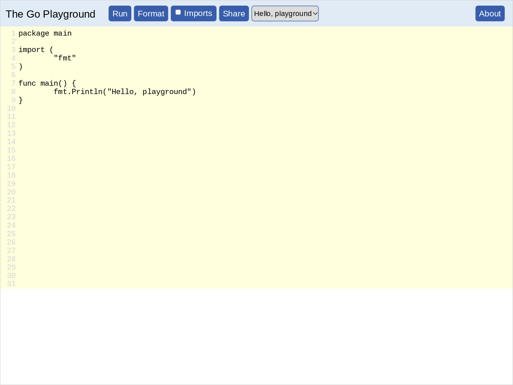
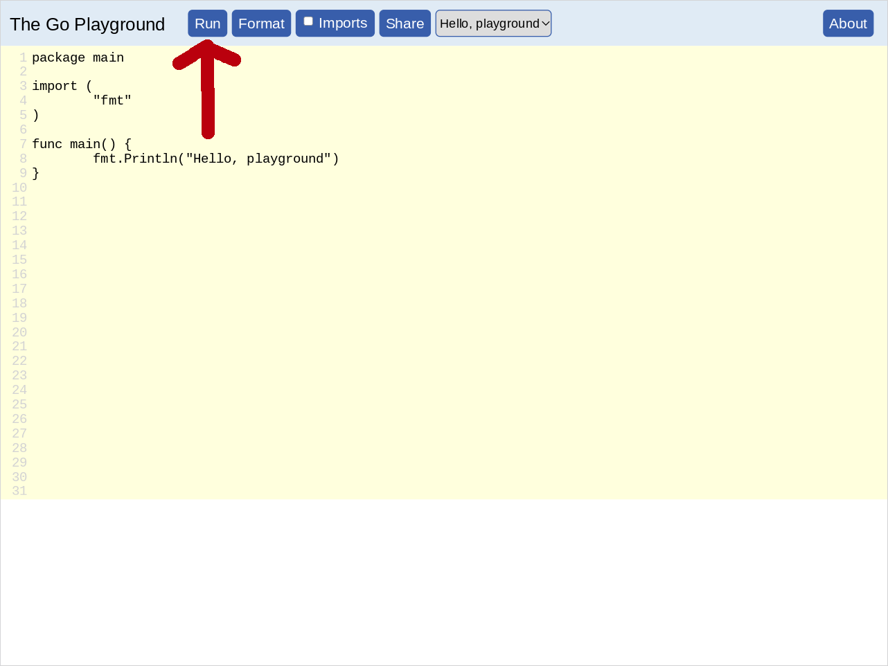
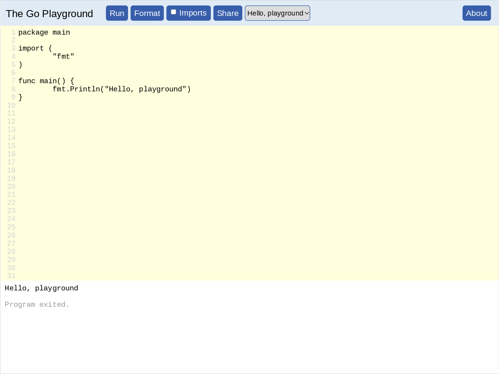
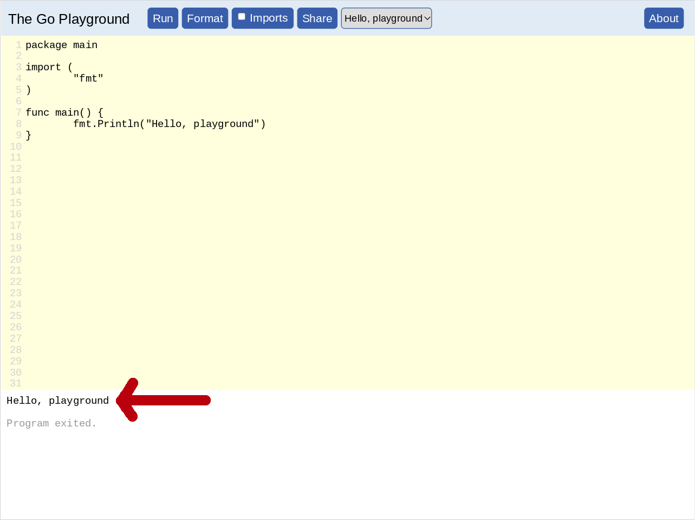
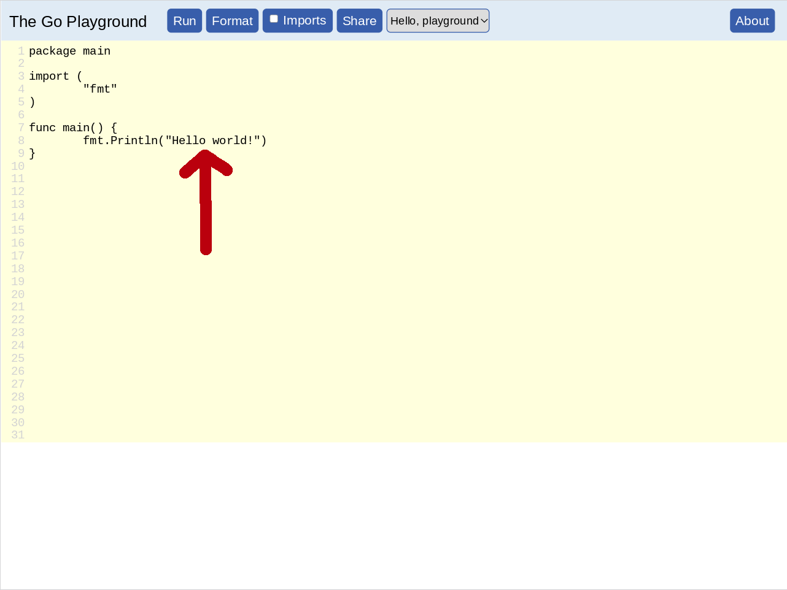
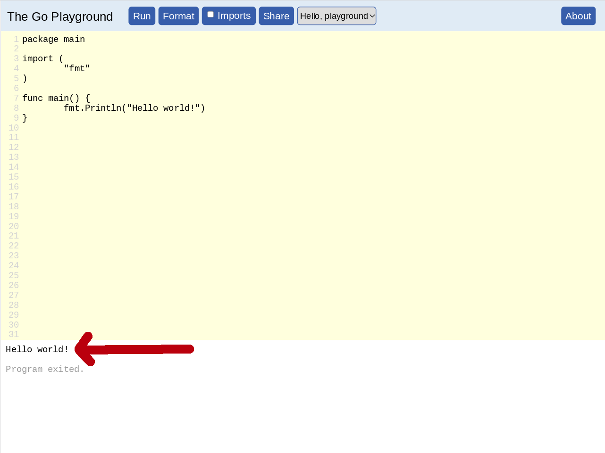
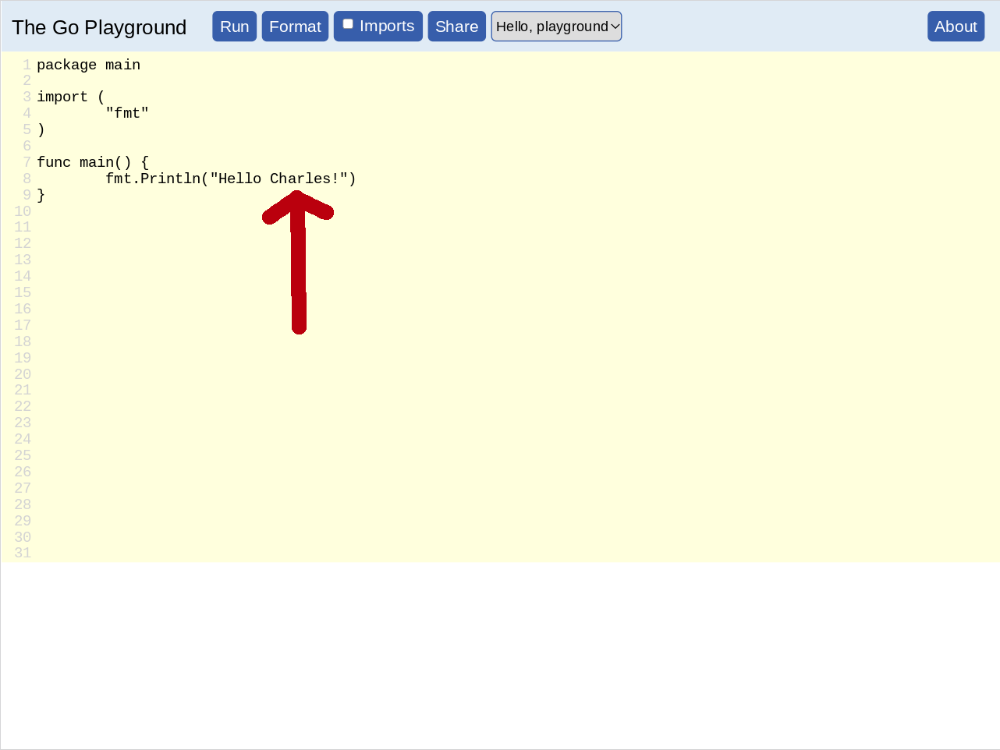
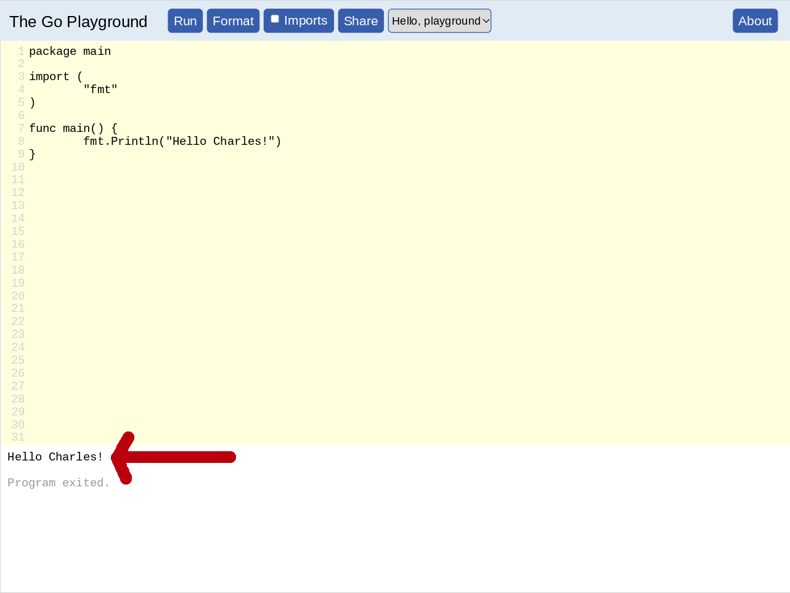
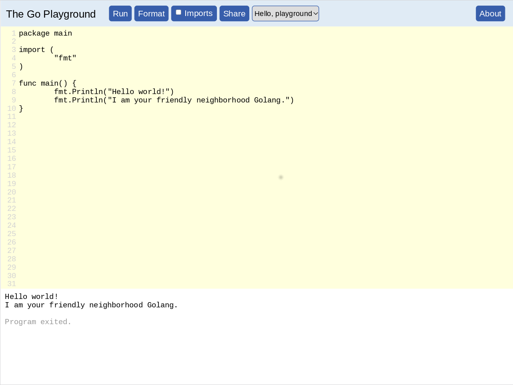

# Learn Golang In One Day

**Go** — also written as **Golang** — is a popular programming language.

This one day **workshop** aims to help you learn to be able to **code** in **Go**.

## PLAY.GOLANG.COM

One of the easiest ways to get started with **Go** is by going to https://play.golang.com/

When you get there you should see something like the following:



When you go to https://play.golang.com/ , it will have some **Go** **code** in there already for you.

```Go
package main

import (
	"fmt"
)

func main() {
	fmt.Println("Hello, playground")
}
```

You can **run** this code by clicking the blue colored button with “Run” written on it:



After you click the the blue colored button with “Run” written on it, that **Go** program will output some text.

That outputted text will be displayed at the bottom of the screen, in the white colored area:



If you are having trouble locating the outputted text, it is here:



Note that what is in between the double quotation marks in the code. I.e.,…
```Go
	fmt.Println("Hello, playground")
```

… is what you see in the output. I.e.,…
```
Hello, playground
```

## PLAY.GOLANG.COM — Hello world!

Now let's edit that **Go** **code**.

Let's change this code:
```Go
	fmt.Println("Hello, playground")
```

… to be:
Let's change this code:
```Go
	fmt.Println("Hello world!")
```


So the whole code would become:
```Go
package main

import (
	"fmt"
)

func main() {
	fmt.Println("Hello world!")
}
```

I.e.,…



Now run that.

And the output you should see should be:



## PLAY.GOLANG.COM — Hello YOUR NAME

Let's get more personal. Let's make that code say our name.

So we are going to change this line:
```Go
	fmt.Println("Hello world!")
```

To something like:
```Go
	fmt.Println("Hello Charles!")
```

Of course, instead “Charles” you should put whatever your name is.

So, if your name if “Robert”, then your code would be:
```Go
	fmt.Println("Hello Robert!")
```

And if your name is “Elizabeth”, then your code would be:
```Go
	fmt.Println("Hello Elizabeth!")
```

But I have to show some name in the screenshot, so I'll just use “Charles”:



Now run that.

And the output you should see should be something like:



Of course, the name you have outputted will be whatever name you used.

## PLAY.GOLANG.COM — fmt.Println()

So far we have just been focusing on what is in between the double quotation marks.
I.e., with the code:
```Go
	fmt.Println("Hello world!")
```
… we were only paying attention to the:
```
	             Hello world!
```

Now we want to pay attention to the `fmt.Println()` part of it.

What is that‽

It is a command. It is something we tell the computer to do.

What `fmt.Println()` means is: **print a line**.

(In fact, “Println” is short for “Print line”.)

## PLAY.GOLANG.COM — fmt.Println() × 2

Now let's write some code with more than one `fmt.Println()` command:
```Go
package main

import (
	"fmt"
)

func main() {
	fmt.Println("Hello world!")
	fmt.Println("I am your friendly neighborhood Golang.")
}
```

Now run that.

This is what you should see:



Note that you now have 2 lines of output.

This is because you have 2 `fmt.Println()` commands in your code.

## PLAY.GOLANG.COM — fmt.Println() × 3

What if we added another `fmt.Println()`:
```Go
package main

import (
	"fmt"
)

func main() {
	fmt.Println("Hello world!")
	fmt.Println("I am your friendly neighborhood Golang.")
	fmt.Println("See you later.")
}
```

Well, then we get another line of output:


## Exercise — fmt.Println()

Now it is your turn write some **Go** **code** on your own.

Here is your exercise.

Write a **Go** program that outputs 7 lines.

(You decide what each text is on each of those lines)

## PLAY.GOLANG.COM — Integers

So far we have been dealing with **strings**.
**Strings** are the things between the double quotation marks.
For example:
```
	"Hello world!"
```

**Go** also supports **numbers**.

One type of **number** that go supports are **integers**.

For example:

* 5
* 4
* 3
* 2
* 1
* 0
* -1
* -2
* -3
* -4
* -5

Here are some more integers:

* -1234
* 742
* -1290387
* 927693
* -786320

Let's write a **Go** program that outputs some integers:
```Go
package main

import (
	"fmt"
)

func main() {
	fmt.Println(1001)
	fmt.Println(-11)
	fmt.Println(0)
}
```

When we run that we should get:

## PLAY.GOLANG.COM — Integer Math

## PLAY.GOLANG.COM — Variables

## CLI

## CLI — go run

## CLI — go build

## CLI — fmt.Scan()

## CLI — Adding Calculator

We now have the skills necessary to create our own very basic **calculator**.

In fact, our calculator will be very very very basic.

All it will do it add 2 numbers that we give it.

Here is the code.

REMEMBER, TYPE THIS CODE OUT YOURSELF. DO NOT COPY-AND-PASTE IT. TYPING IT OUT WILL HELP YOU LEARN IT.

```Go
package main

import (
	"fmt"
)

func main() {
	fmt.Println("Please provide the first number:")

	var firstNumber int
	fmt.Scan(&firstNumber)

	fmt.Println("Please provide the second number:")

	var secondNumber int
	fmt.Scan(&secondNumber)

	fmt.Println("Result:")
	fmt.Println(firstNumber + secondNumber)
}
```

Run this program and see if it works.

## Exercise — Subtracting Calculator

## CLI — for-ever

## CLI — Looping Calculator

## CLI — Exiting Looping Calculator

## CLI — os.Args

## CLI — os.Open()

## CLI — io.Read

## CLI — Interpreter

## CLI — io.Write

## CLI — drawing

## CLI — drawing — rectangle

## CLI — drawing — ellipse

## Exercise — Draw a Face

## CLI — drawing — color
