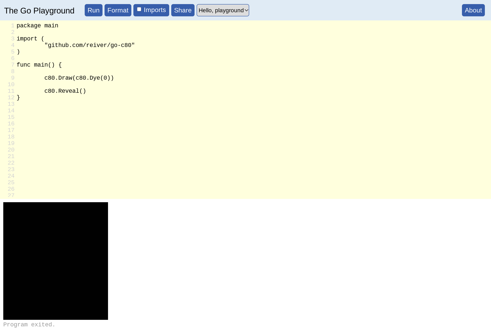
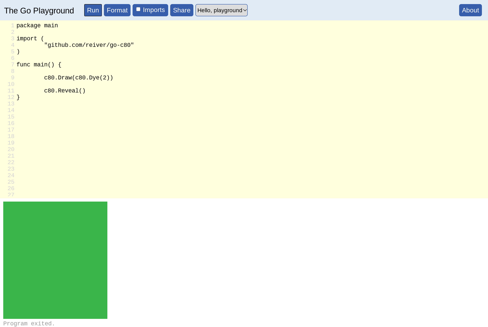
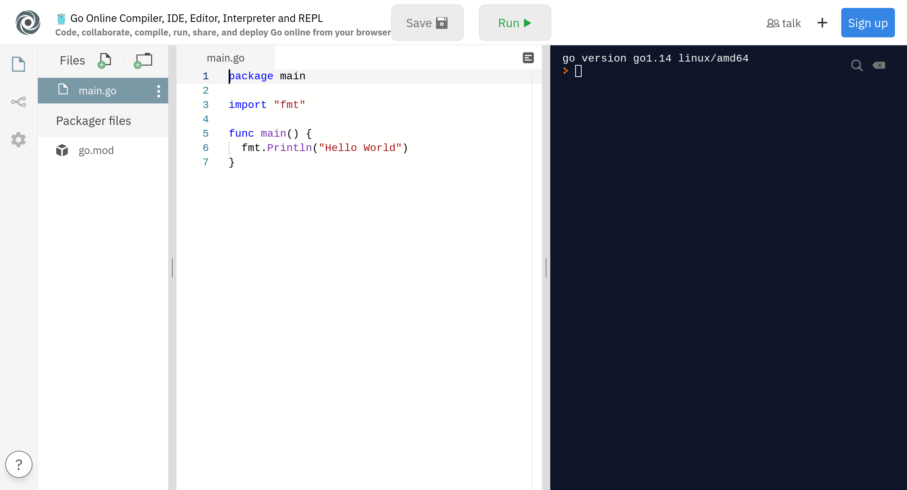
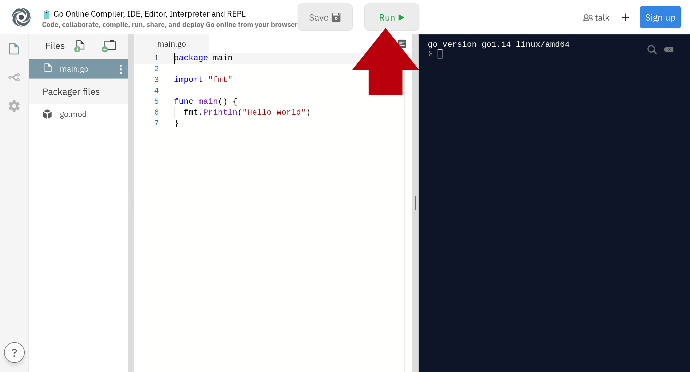
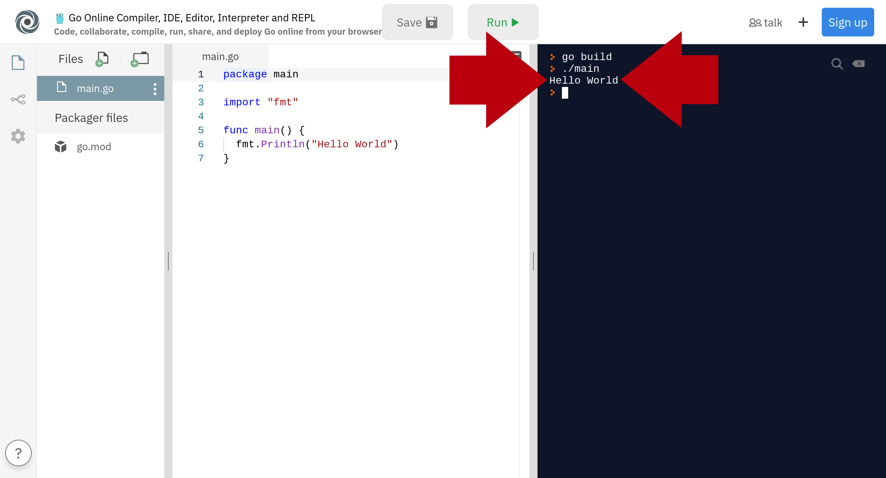

# Learn Golang In One Day

**Go** — also written as **Golang** — is a popular programming language.

This one day **workshop** aims to help you learn to be able to **program** in **Go**.

If you are reading this, or in a class that is covering this, you are here to learn **programming** in **Go**.

You may be even _learning programming_ for the first time!
That is great, this _workshop_ is for you!

## Table of Contents

* [Preamble](#preamble)
  * [Words and Meanings](#words-and-meanings)
  * [Example Programs](#example-programs)
  * [How To Learn](#how-to-learn)
  * [One Secret Of Success: Perseverance](#one-secret-of-success-perseverance)
* [fmt.Println()](#fmtprintln)
  * [PLAY.GOLANG.ORG](#playgolangorg)
  * [PLAY.GOLANG.ORG — Hello world!](#playgolangorg--hello-world)
  * [PLAY.GOLANG.ORG — Hello YOUR NAME](#playgolangorg--hello-your-name)
  * [PLAY.GOLANG.ORG — fmt.Println()](#playgolangorg--fmtprintln)
  * [PLAY.GOLANG.ORG — fmt.Println() × 2](#playgolangorg--fmtprintln--2)
  * [PLAY.GOLANG.ORG — fmt.Println() × 3](#playgolangorg--fmtprintln--3)
  * [Exercise — fmt.Println()](#exercise--fmtprintln)
  * [PLAY.GOLANG.ORG — fmt.Println() — multiple × 2](#playgolangorg--fmtprintln--multiple--2)
  * [PLAY.GOLANG.ORG — fmt.Println() — multiple × 3](#playgolangorg--fmtprintln--multiple--3)
  * [PLAY.GOLANG.ORG — fmt.Println() — multiple × 4](#playgolangorg--fmtprintln--multiple--4)
  * [Exercise — fmt.Println() — multiple](#exercise--fmtprintln--multiple)
* [Very Basic Go Program Structure](#very-basic-go-program-structure)
* Go Integers
  * [PLAY.GOLANG.ORG — Integers](#playgolangorg--integers)
  * [PLAY.GOLANG.ORG — Integer Math](#playgolangorg--integer-math)
  * [PLAY.GOLANG.ORG — Integer Math — version 2](#playgolangorg--integer-math--version-2)
  * [Exercise — 1+2+3+5+8+13+21](#exercise--123581321)
* Go `import`
  * [Go import Statements](#go-import-statements)
* c80
  * [PLAY.GOLANG.ORG — drawing](#playgolangorg--drawing)
* c80.Dye()
  * [PLAY.GOLANG.ORG — drawing — dye — 0](#playgolangorg--drawing--dye--0)
  * [PLAY.GOLANG.ORG — drawing — dye — 1](#playgolangorg--drawing--dye--1)
  * [PLAY.GOLANG.ORG — drawing — dye — 2](#playgolangorg--drawing--dye--2)
  * [c80.Dye() Colors](#c80dye-colors)
  * [Exercise — c80.Dye()](#exercise--c80dye)
* c80.Rectangle()
  * [PLAY.GOLANG.ORG — drawing — rectangle](#playgolangorg--drawing--rectangle)
  * [PLAY.GOLANG.ORG — drawing — more rectangles](#playgolangorg--drawing--more-rectangles)
  * [Exercise — Draw a Face](#exercise--draw-a-face)
* Go Variables
  * [PLAY.GOLANG.ORG — Move the Face](#playgolangorg--move-the-face)
  * [PLAY.GOLANG.ORG — Variables](#playgolangorg--variables)
  * [PLAY.GOLANG.ORG — Variables — Move the Face](#playgolangorg--variables--move-the-face)
  * [Exercise — Move the Face Again](#exercise--move-the-face-again)
* Go Functions
  * [PLAY.GOLANG.ORG — Many Faces](#playgolangorg--many-faces)
  * [PLAY.GOLANG.ORG — functions](#playgolangorg--functions)
  * [PLAY.GOLANG.ORG — functions — Many Faces](#playgolangorg--functions--many-faces)
  * [Exercise — Many Many Faces](#exercise--many-many-faces)
* [CLI](#cli)
  * [CLI Development Environment](#cli-development-environment)
  * [Exercise — CLI — fmt.Println() × 5](#exercise--cli--fmtprintln--5)
  * [CLI — rcv.Readln()](#cli--rcvreadln)
  * [CLI — Adding Calculator](#cli--adding-calculator)
  * [Exercise — Subtracting Calculator](#exercise--subtracting-calculator)
* Go `switch`
  * [CLI — switch](#cli--switch)
  * [CLI — Multifunctional Calculator](#cli--multifunctional-calculator)
  * [Exercise — Add Multiplication To The Multifunctional Calculator](#exercise--add-multiplication-to-the-multifunctional-calculator)
* Go `for`
  * [CLI — for-ever](#cli--for-ever)
  * [CLI — Looping Calculator](#cli--looping-calculator)
* Go `if`
  * [CLI — if](#cli--if)
  * [CLI — Exiting Looping Calculator](#cli--exiting-looping-calculator)
* [Go Slices](#go-slices)
  * [Infix Notation](#infix-notation)
  * [strings.Split()](#stringssplit)
  * [Infix Adding Calculator](#infix-adding-calculator)
  * [Exercise — Infix Multifunctional Calculator](#exercise--infix-multifunctional-calculator)
  * [Exercise — Infix Looping Calculator](#exercise--infix-looping-calculator)
  * [Exercise — Infix Exiting Looping Calculator](#exercise--exiting-infix-looping-calculator)

____________________

____________________

____________________

____________________

## Preamble

____________________

### Words and Meanings

People write **source code**.  For example:
```Go
package main

import (
	"fmt"
)

func main() {
	fmt.Println("Hello world!")
}
```

We often shorten **source code** to just **code**:

So — people write **code**.

Why do people write **code** — People write **code** to tell computers what to do.

The people who write **code** are often called:

* **computer programmer**,
* **programmer**,
* **computer scientist**,
* **software engineer**,
* **software architect**,
* **software developer**,
* **software development engineer**, and
* **coder**.

Some older labels for _people who write code_ that don't seem to be used that much anymore include:

* **computer analyst**, and
* **system analyst**.

Some newer (but less common) labels I have seen for _people who write code_ include:

* **software scientist**,
* **cyber lord**.

New labels for _people who write code_ seem to be created every so often.

The act of writing **code** is often called:

* **programming**, or
* **coding**.

Often ‘computers’ do NOT understand the **code**. In these cases the **code** can be turned into a **program**.

The **program** will contain **instructions** that the ‘computer’ will understand.

A **program** that is meant to be used by a regular person is called an **application**.

We often shorten **application** to just **app**.

### Example Programs

Mobile phones have **programs** on them. Some of the programs on mobile phones get called “apps”.
But the “Android” & “iOS” _operating systems_ that run many of these phones are also **programs**.

Laptops computers also have **programs** on them.

Video game consoles have **programs** on them. For example, the video games you play on these consoles are **programs**.

Flying drones have **programs** on them.

Modern cars have **programs** on them.

Etc etc etc.

**Programs** are all over the place.

### How To Learn

EVEN THOUGH I HAVE SHOWN ALL THE CODE HERE.
DO NOT COPY-AND-PASTE THE CODE.
TYPE OUT THE CODE YOURSELF.
TYPING OUT THE CODE YOURSELF WILL HELP YOU LEARN TO CODE.

### One Secret Of Success: Perseverance

Here is one the secrets to **learning** how to code.

Here is one of the secrets to becoming good — to becoming very very good — at programming.

It is the same secret for both.

One of the secrets to success as a programmer is: **perseverance**.

> perseverance (noun): persistence in doing something despite difficulty or delay in achieving success.

One of the reasons software developers get paid so much is that they are willing & able to work on a problem until they figure it out and solve it.

Some of these problems might take **hours** to solve.

Some of these problems might take **days** to solves.

Some might takes **weeks**.

Some might even takes **months**, or **years**!

And I am _not_ exaggerating.

A software developer who helps create new companies may spend months creating the technology for that new company.
Some may even spend more than a year doing this!

Most tasks most experienced software developers tackle usually take hours, days, or weeks.

But software developers get paid a lot to do this!

Infact this is a big part of _why_ software develoeprs get paid a lot to do this.

So when you are learning all this — especially if you are learning **programming** for the first time —
keep at it,
don't give up,
this stuff isn't always easy,
but that is what programming is like.

And if you learn how to do this, and choose to pursue a career doing this, you can get paid a lot _because_ you are willing to **persevere** —
_because_ you are willing to work for hours, weeks, months, or even years, on a problem until you figure it out and solve it.

____________________

____________________

____________________

____________________

## fmt.Println()

____________________

### PLAY.GOLANG.ORG

One of the easiest ways to get started with **Go** is by going to the **Go Playground** at https://play.golang.org/

When you get there you should see something like the following:


When you go to the **Go Playground** at https://play.golang.org/ , it will have some **Go** **code** in there already for you.

```Go
package main

import (
	"fmt"
)

func main() {
	fmt.Println("Hello, playground")
}
```

You can **run** this code by clicking the blue colored button with “Run” written on it:


After you click the the blue colored button with “Run” written on it, that **Go** program will output some text.

That outputted text will be displayed at the bottom of the screen, in the white colored area:


If you are having trouble locating the outputted text, it is here:


Note that what is in between the double quotation marks in the code. I.e.,…
```Go
	fmt.Println("Hello, playground")
```

… is what you see in the output. I.e.,…
```
Hello, playground
```

### PLAY.GOLANG.ORG — Hello world!

Now let's edit that **Go** **code**.

Let's change this code:
```Go
	fmt.Println("Hello, playground")
```

… to be:
```Go
	fmt.Println("Hello world!")
```


So the whole code would become:
```Go
package main

import (
	"fmt"
)

func main() {
	fmt.Println("Hello world!")
}
```

I.e.,…


Now run that.

And the output you should see should be:


And again note that what was between the double quotation marks:
```Go
	fmt.Println("Hello world!")
```
… is what you see in the output. I.e.,…
```
Hello world!
```

### PLAY.GOLANG.ORG — Hello YOUR NAME

Let's get more personal. Let's make that code say your name.

So we are going to change this line:
```Go
	fmt.Println("Hello world!")
```

To something like:
```Go
	fmt.Println("Hello Charles!")
```

Of course, instead of “Charles” you should put whatever your name is.

So, if your name if “Robert”, then your code would be:
```Go
	fmt.Println("Hello Robert!")
```

And if your name is “Elizabeth”, then your code would be:
```Go
	fmt.Println("Hello Elizabeth!")
```

But I have to show some name in the screenshot, so I'll just use “Charles”:


Now run that.

And the output you should see should be something like:


Of course, the name you have outputted will be whatever name you used.

### PLAY.GOLANG.ORG — fmt.Println()

So far we have just been focusing on what is in between the double quotation marks.
I.e., with the code:
```Go
	fmt.Println("Hello world!")
```
… we were only paying attention to the:
```
	             Hello world!
```

Now we want to pay attention to the `fmt.Println()` part of it.

What is that‽

It is a command. It is something we tell the computer to do.

What `fmt.Println()` means is: **print a line**.

(In fact, “Println” is short for “Print line”.)

### PLAY.GOLANG.ORG — fmt.Println() × 2

Now let's write some code with more than one `fmt.Println()` command:
```Go
package main

import (
	"fmt"
)

func main() {
	fmt.Println("Hello world!")
	fmt.Println("I am your friendly neighborhood Golang.")
}
```

Now run that.

This is what you should see:


Note that you now have 2 lines of output.

This is because you have 2 `fmt.Println()` commands in your code.

### PLAY.GOLANG.ORG — fmt.Println() × 3

What if we added another `fmt.Println()`:
```Go
package main

import (
	"fmt"
)

func main() {
	fmt.Println("Hello world!")
	fmt.Println("I am your friendly neighborhood Golang.")
	fmt.Println("See you later.")
}
```

Well, then we get another line of output:


Note that you now have 3 lines of output.

This is because you have 3 fmt.Println() commands in your code.

### Exercise — fmt.Println()

Now it is your turn write some **Go** **code** on your own.

Here is your exercise.

Write a **Go** program that outputs 7 lines.

(You decide what each text is on each of those lines)

### PLAY.GOLANG.ORG — fmt.Println() — multiple × 2

By now you have some familiarity with `fmt.Println()`.

Now watch this:

```Go
package main

import (
	"fmt"
)

func main() {
	fmt.Println("Hello world!", "How are you doing?")
}
```

Did you notice that is different?

Look closely at the `fmt.Println()` command:
```Go
	fmt.Println("Hello world!", "How are you doing?")
```

Do you see it?

There are 2 strings in there, and not just 1.

Before we had stuff stuff as:
```Go
	fmt.Println("Hello world!")
	fmt.Println("I am your friendly neighborhood Golang.")
	fmt.Println("See you later.")
```

Which all only have 1 string inside of `fmt.Println()`.

But with:
```Go
	fmt.Println("Hello world!", "How are you doing?")
```
… we have 2 strings inside of `fmt.Println()`.

Let us see what happens when we run that code:

### PLAY.GOLANG.ORG — fmt.Println() — multiple × 3

### PLAY.GOLANG.ORG — fmt.Println() — multiple × 4

### Exercise — fmt.Println() — multiple

Now it is again your turn write some **Go** **code** on your own.

Here is your exercise.

Write a **Go** program that outputs 3 lines.

But where the 1st `fmt.Println()` has 1 string.
The 2nd `fmt.Println()` has 2 strings.
And the 3rd `fmt.Println()` has 3 strings.

(You decide what each of those strings are.)

____________________

____________________

____________________

____________________

## Very Basic Go Program Structure

At this point, you may have noticed a pattern.

All these programs start with:
```Go
package main

import (
	"fmt"
)

func main() {
```

And they end with:
```Go
}
```

And between that beginning, and end is the code we write.

In other words:
```Go
package main

import (
	"fmt"
)

func main() {

	// YOUR
	//
	// CODE
	//
	// GOES
	//
	// HERE
}
```

So, for example, I could write:
```Go
package main

import (
	"fmt"
)

func main() {

	fmt.Println("I was here")
}
```

Or:
```Go
package main

import (
	"fmt"
)

func main() {

	fmt.Println("MY")
	fmt.Println("CODE")
	fmt.Println("IS")
	fmt.Println("HERE")
}
```

Or whatever else I want in that space!

## PLAY.GOLANG.ORG — Integers

So far we have been dealing with **strings**.
**Strings** are the things between the double quotation marks.
For example:
```
	"Hello world!"
```

**Go** also supports **numbers**.

One type of **number** that go supports are **integers**.

For example:

* 5
* 4
* 3
* 2
* 1
* 0
* -1
* -2
* -3
* -4
* -5

Here are some more integers:

* -1234
* 742
* -1290387
* 927693
* -786320

Let's write a **Go** program that outputs some integers:
```Go
package main

import (
	"fmt"
)

func main() {
	fmt.Println(1001)
	fmt.Println(-11)
	fmt.Println(0)
}
```

When we run that we should get:


## PLAY.GOLANG.ORG — Integer Math

One common thing people do with **numbers** — including **integers** — is **math**.

For example:

### Addition

```Go
3 + 2
```

### Subtration

```Go
3 - 2
```

### Multiplication

```Go
3 * 2
```
### Division

```Go
3 / 2
```

```Go
3 % 2
```

### Code

Let's see create some **Go** code to try all those out:
```Go
package main

import (
	"fmt"
)

func main() {

	fmt.Println(3 + 2)
	fmt.Println(3 - 2)
	fmt.Println(3 * 2)
	fmt.Println(3 / 2)
	fmt.Println(3 % 2)
}
```

When we run that we should get:


## PLAY.GOLANG.ORG — Integer Math — version 2

The output of that was a bit difficult to read — in that it was a bit difficult to determine which number was the result of which calculation.

But we can fix that.

Take a look at this code:
```Go
package main

import (
	"fmt"
)

func main() {

	fmt.Println("3 + 2 =", 3 + 2)
	fmt.Println("3 - 2 =", 3 - 2)
	fmt.Println("3 * 2 =", 3 * 2)
	fmt.Println("3 / 2 =", 3 / 2)
	fmt.Println("3 % 2 =", 3 % 2)
}
```

That probably looks weird. Maybe even a bit confusing. So let's break that down.

Recall from before that we can put multiple things in a `fmt.Println()`. For example:
```Go
	fmt.Println("Hello world!", "How are you doing?")
```

That is what we did that in that new code too. We put multiple things in the `fmt.Println()`.

The 1st thing we put in the `fmt.Println()` are strings. The 2nd thing we in the `fmt.Println()` are those integer calculations.

This might make more sense if we just run the code. So let's run the code:


## Exercise — 1+2+3+5+8+13+21

It is now time for you to write a **Go** program of your own.

Write a program that outputs the result of this math operation:
```
1+2+3+5+8+13+21
```

## Go import Statements

Recall from before when we went over the **very basic Go program structure** we saw this:
```Go
package main

import (
	"fmt"
)

func main() {

	// YOUR
	//
	// CODE
	//
	// GOES
	//
	// HERE
}
```

Before were just focusing on this part:
```Go
	// YOUR
	//
	// CODE
	//
	// GOES
	//
	// HERE
```

And ignoring the rest.

Now, we are going to pay attention to the `import` statements:
```Go
import (
	"fmt"
)
```

What does this mean?


Well, what happens if we take our **Hello world!** program (from before):
```Go
package main

import (
	"fmt"
)

func main() {
	fmt.Println("Hello world!")
}
```

But _remove_ the import statement:
```Go
package main

func main() {
	fmt.Println("Hello world!")
}
```

And the run it. Let's see what happens:


**We go an error!**

> ./prog.go:4:2: undefined: fmt
> 
> Go build failed.

The part that says _“`Go build failed.`”_ tells we got an error — it tells us _something_ is wrong.

The other part that says _“`./prog.go:4:2: undefined: fmt`”_ tells us what is wrong.

That bit that says _“`./prog.go:4:2:`”_ tells us there is an error on **line 4**.

And the bit that says _“undefined: fmt`”_ tells us that the error on _line 4_ is that it doesn't know what `fmt` is.


Well, in this case, the import part is the `fmt` part:
```Go
	"fmt"
```

This tells Go that we want everything in the `fmt` package.

We can see what is in the Go `fmt` package by looking at the documentation here:
https://golang.org/pkg/fmt/

There is a lot of stuff in there. But if we look carefully, we will eventually find the `fmt.Println()` function we were using here:
https://golang.org/pkg/fmt/#Println

Awesome. **So then the `import "fmt"` statement makes it so we can use `fmt.Println()`.**

What if instead of this:
```Go
import (
	"fmt"
)
```

We had this:
```Go
import (
	"fmt"
	"math"
)
```

Now we have 2 imports — we are importing packge `fmt`, and we are also importing package `math`.

We already know when we import package `fmt` we bring in everything in here:
https://golang.org/pkg/fmt/

So, similarly, when we import package `math` we bring in everything from here:
https://golang.org/pkg/math/


## PLAY.GOLANG.ORG — drawing

Let's change things up a bit.

So far the result of all of our **Go** programs has been plain text — letters, numbers, etc.

Let's use **Go** to create some images.

Recall from before that our basic **Go** program structure was:
```Go
package main

import (
	"fmt"
)

func main() {

	// YOUR
	//
	// CODE
	//
	// GOES
	//
	// HERE
}
```

So that we can draw images — rather that output plain text — we are going to make one change to that basic **Go** program structure was. This:
```Go
package main

import (
	"github.com/reiver/go-c80"
)

func main() {

	// YOUR
	//
	// CODE
	//
	// GOES
	//
	// HERE
}
```
Did you notce what changed‽ One thing changed.

This:
```Go
import (
	"fmt"
)
```

… changed into this:
```Go
import (
	"github.com/reiver/go-c80"
)
```

There are 2 results of this change:…

result №1: the `fmt.Println()` function is gone, and

result №2: we have a whole bunch of new functions available to use — that all start with `c80.` — that will give us the power to draw images.

## PLAY.GOLANG.ORG — drawing — dye — 0

Enough talk, let's draw something.

Here is some **Go** code that will let us draw an image:
```Go
package main

import (
	"github.com/reiver/go-c80"
)

func main() {

	c80.Draw(c80.Dye(0))

	c80.Reveal()
}
```
Now run that.

This is what you should see:



Look at that. There is a completely **black** image at the bottom.

We drew that!

## PLAY.GOLANG.ORG — drawing — dye — 1

Now let's do the same thing, but change just one thing in that code.

Let's change this:
```Go
c80.Draw(c80.Dye(0))
```
… to this:
```go
c80.Draw(c80.Dye(1))
```

I.e., change the `0` to a `1`.

And thus have:
```Go
package main

import (
	"github.com/reiver/go-c80"
)

func main() {

	c80.Draw(c80.Dye(1))

	c80.Reveal()
}
```
Now run that.

This is what you should see:


Look at that. We now have completely **red** image.

(Recall that before the image was completely _black_.)

## PLAY.GOLANG.ORG — drawing — dye — 2

Now let's do the same thing again, but again change just one thing in that code.

This time let's change this:
```Go
c80.Draw(c80.Dye(1))
```
… to this:
```go
c80.Draw(c80.Dye(2))
```
I.e., change the `1` to a `2`.

And thus have:
```Go
package main

import (
	"github.com/reiver/go-c80"
)

func main() {

	c80.Draw(c80.Dye(2))

	c80.Reveal()
}
```
Now run that.

This is what you should see:



Now the image is completely green.

## c80.Dye() Colors

So, what is going on here?

The first thing going on here is that this line seems to be special:
```Go
	c80.Draw(c80.Dye(3))
```

And changing hat number seems to change the color of the rectangle.

So far we have seen that:

* 0 🡆 black
* 1 🡆 red
* 2 🡆 green

What colors do you think these number will give?:

* 3
* 4
* 5
* 6
* 7

Let's find out!

## Exercise — c80.Dye()

Now it is your turn write some **Go code** on your own.

Here is your exercise.

Figure out what integer will give you a **yellow** color.

Figure out what integer will give you a **blue** color.

Figure out what integer will give you a **grey** color.

## PLAY.GOLANG.ORG — drawing — rectangle

Let's draw more than just a solid color.

Let's draw some rectangles.

The **c80** package has a `c80.Rectangle()` function.

Let's see this in action. Here is some code:

```Go
package main

import (
	"github.com/reiver/go-c80"
)

func main() {
	c80.Draw(c80.Dye(4))

	c80.Draw(c80.Rectangle(70,50, 50,80, 1))

	c80.Reveal()
}
```

And here is what you see when you run this:


We have an image that mostly **blue**.
But there is **red rectangle** draw on it.

How did we get that?

Let's look at our code.

The 1st thing in our code is:
```Go
	c80.Draw(c80.Dye(4))
```

What does that do‽ — it makes it so the whole image is colored **blue**.

And why **blue**‽ — because (as you discovered during the exercise) that `4` gives us **blue**.

OK, but our image isn't just a **blue**. There is a **red rectangle** draw on it too.

That's where the 2nd thing in our code comes into play:
```Go
	c80.Draw(c80.Rectangle(70,50, 50,80, 1))
```

We see the `c80.Rectangle()` function in there. But what do all those numbers mean?


## PLAY.GOLANG.ORG — drawing — more rectangles

```Go
package main

import (
	"github.com/reiver/go-c80"
)

func main() {
	c80.Draw(c80.Dye(4))

	c80.Draw(c80.Rectangle(70,50, 50,80, 1))

	c80.Draw(c80.Rectangle(90,80, 90,30, 6))

	c80.Reveal()
}
```

Now we have 2 rectangles.

But wait — did you notice that one of the rectangles is blocking the other one?

The first **draw rectangle** command draw a **red rectangle**:
```Go
	c80.Draw(c80.Rectangle(70,50, 50,80, 1))
```

But the second **draw rectangle** command draws a **light-blue rectangle**:
```Go
	c80.Draw(c80.Rectangle(90,80, 90,30, 6))
```

And that **light-blue rectangle** is in front of **red rectangle**.

What does this mean? — **What this means is that the order in which you have these commands matters.

For example, if you switch the 2 **draw rectangle** commands, then **red rectangle** would be in front, and the **light-blue rectangle** would be behind.
```Go
package main

import (
	"github.com/reiver/go-c80"
)

func main() {
	c80.Draw(c80.Dye(4))

	c80.Draw(c80.Rectangle(90,80, 90,30, 6))

	c80.Draw(c80.Rectangle(70,50, 50,80, 1))

	c80.Reveal()
}
```


## Exercise — Draw a Face

## PLAY.GOLANG.ORG — Move the Face

## PLAY.GOLANG.ORG — Variables

## PLAY.GOLANG.ORG — Variables — Move the Face

## Exercise — Move the Face Again

## PLAY.GOLANG.ORG — Many Faces

## PLAY.GOLANG.ORG — functions

## PLAY.GOLANG.ORG — functions — Many Faces

## Exercise — Many Many Faces

## PLAY.GOLANG.ORG — drawing — pixel

## PLAY.GOLANG.ORG — drawing — color

## Exercise — Color the Face

____________________

____________________

____________________

____________________

## CLI

____________________

### CLI Development Environment

We are going to switch things up now. We are going to switch to an alternative Go **development environment**.

So far we haev been using the **Go Playground** — https://play.golang.org/

Now we are going to switch to **repl.it for Go** — https://repl.it/languages/go

(We are making this switch because the **Go Playground** doesn't allow us to get input from the user, but **repl.it for Go** does.)

When you go to https://repl.it/languages/go you should see something similar to:



Just like when we went to the Go Playground, when we go to _repl.it for Go_ https://repl.it/languages/go , it will have some Go code in there already for us.
```Go
package main

import "fmt"

func main() {
  fmt.Println("Hello World")
}
```

We can run this code by clicking the button with “Run” written on it:



After you click the the button with “Run” written on it, that Go program will output some text.

That outputted text will be displayed at the right side of the screen, in the black colored area:


If you are having trouble locating the outputted text, it is here:



### Exercise — CLI — fmt.Println() × 5

Because this**repl.it for Go**— https://repl.it/languages/go — is new to us.

Let's just make sure we know how to use it.

Here is your exercise.

Write a **Go** program that outputs 5 lines using the **repl.it for Go** — https://repl.it/languages/go

(You decide what each of those lines are.)

### CLI — rcv.Readln()

(OK, so let's now get to the reason we switched from the **Go Playground** to **repl.it for Go**.)

So far we have been outputting content — using `fmt.Println()`.

Now let's get input — let's make it so the user can type things in, and communicate with our program.

We are going to use `rcv.Readln()` for this — which will **read a line** that the user types in.

The keen observers our there might have guessed that **“Readln”** is short for **“read line”**.
(This is similar to how **“Println”** is short for **“print line”**.)

The `rcv.Readln()` will make a program wait for the user to type something, and then press the `ENTER` key to tell the program that the user is done giving input.

**That means that when you run the program it will sit there and wait.**
And if you don't press the `ENTER` key, it will keep waiting for you.

So let's look at some basic code:
```Go
package main

import (
	"github.com/reiver/go-rcv"

	"fmt"
)

func main() {

	fmt.Println("Enter something.")
	fmt.Println("(press the [ENTER] key when you are done)")

	var line string
	rcv.Readln(&line)

	fmt.Println("YOU ENTERED:", line)
}
```

There are 3 parts to this code.

The first part of the is this:
```Go
	fmt.Println("Enter something.")
	fmt.Println("(press the [ENTER] key when you are done)")
```

This will output 2 lines — since there are 2 `fmt.Println()` calls. And those 2 lines will be:

> Enter something.
> (press the [ENTER] key when you are done)

The second part of the code is this:
```Go
	var line string
	rcv.Readln(&line)
```

We are using our new `rcv.Readln()` function here.

This will wait for the user to type something, and then press the `ENTER` key.

After that happens — after the user presses the `ENTER` key — this code will store what the user typed in the variable we named `line`.

The third, and last part of the code is this:
```Go
	fmt.Println("YOU ENTERED:", line)
```

It will output what is in the `line` variable.
That way we can see if everything worked.

OK, let's run the code.

When we run this code we should see:


Which is what we expected. Remember, the first part of the code is this:
```Go
	fmt.Println("Enter something.")
	fmt.Println("(press the [ENTER] key when you are done)")
```

… which outputted the message we see in that screenshot.

And then the second part of the code is this:
```Go
	var line string
	rcv.Readln(&line)
```

Which will wait for us to type something, and then (for us) to press the `ENTER` key.

So, at this point the program is waiting for us to enter something.

OK, so let's enter something….

If we then type, for the sake of example, this:

> apple BANANA Cherry

We will see:


And if we then press the `ENTER` key, we will then get:


And as we can see, we got the output from the third, and final part of the code:
```Go
	fmt.Println("YOU ENTERED:", line)
```

### CLI — Adding Calculator

Now that we have learned about `rcv.Readln()` we have sufficient tools to create our own very basic **calculator**.

This calculator will be very very very basic — all it will do it _add_ 2 numbers together that we give it. But it will work.

Here is the code….

**REMEMBER, TYPE THIS CODE OUT YOURSELF. DO NOT COPY-AND-PASTE IT. TYPING IT OUT WILL HELP YOU LEARN IT.**

```Go
package main

import (
	"github.com/reiver/go-rcv"

	"fmt"
)

func main() {
	fmt.Println("Please provide the first number:")

	var firstNumber int64
	rcv.Readln(&firstNumber)

	fmt.Println("Please provide the second number:")

	var secondNumber int64
	rcv.Readln(&secondNumber)

	fmt.Println("Result:")
	fmt.Println(firstNumber + secondNumber)
}
```

This is what this will look like in **repl.it for Go** — https://repl.it/languages/go


And when we run this program we will see:


This makes sense because — first — the first part of the code is run:
```Go
	fmt.Println("Please provide the first number:")
```

Which outputs the message:

> Please provide the first number:

Which is what we see in the screenshot.

And then after this, the second part of the code is run:
```Go
	var firstNumber int64
	rcv.Readln(&firstNumber)
```

This part of the code waits for the user to type in something and then press the `ENTER` key.

In this case _the user_ is us. And since we have no pressed the `ENTER` key yet, it will just sit there and wait for us (until we do).

So, let's type in:

> 33

When we do that, we will see:


And then, if we press the `ENTER` key, the line we entered will get stored in that `firstNumber` variable.

And we will see:


What we see in this screenshot also makes sense, because what happened next (after we pressed the `ENTER` key) is that the third part of the code was run:
```Go
	fmt.Println("Please provide the second number:")
```

Which outputted the message:

> Please provide the second number:

Which is what see in the screenshot.

And then, after that, the fourth part of the code is run:
```Go
	var secondNumber int64
	rcv.Readln(&secondNumber)
```

Like when we used the `rcv.Readln()` function before — this part of the code waits for the user to type in something and then press the `ENTER` key.

Again, in this case _the user_ is us. And since we have no pressed the `ENTER` key yet, it will just sit there and wait for us (until we do).

So, let's type in:

> 22

When we do that, we will see:


And then, if we press the `ENTER` key, the line we entered will get stored in that `secondNumber` variable.

And we will see:


Which makes sense because what happened next is the fifth part of the code was run:
```Go
	fmt.Println("Result:")
	fmt.Println(firstNumber + secondNumber)
```

Which outputted:

> Result:
> 55

And the second line of output there is 55 because `firstNumber` has 33 in it, and `secondNumber` has 22 in it.
And `firstNumber` has 33 in it, and `secondNumber` has 22 in it because those are the numbers we typed in.

### Exercise — CLI — Subtracting Calculator

Now it is your turn to do some coding.

We will keep it simple, because the point of this example 

## CLI — switch

## CLI — Multifunctional Calculator

Now that we learned the **Go** `switch` statement, we can create something pretty cool.

Now that we know how to use the **Go** `switch` statement, we can use it to make a calculator handle both **addition**, and **subtraction**.

Most normal calculators don't just handle addition, or just handle subtraction.
Most normal calculators handle both addition **and** substraction.

So we are going to do that.
We are going to make a calculator that can handle both addition **and** substraction.

Here is our **Go** **code** for that:

```Go
package main

import (
	"github.com/reiver/go-rcv"

	"fmt"
)

func main() {
	fmt.Println("Please provide the first number:")

	var firstNumber int64
	rcv.Readln(&firstNumber)

	fmt.Println("Please provide the second number:")

	var secondNumber int64
	rcv.Readln(&secondNumber)

	fmt.Println("Please tell me what operation you want to do:")

	var operation string
	rcv.Readln(&operation)

	var result int64
	switch operation {
	case "+":
		result = firstNumber + secondNumber
	case "-":
		result = firstNumber - secondNumber
	}

	fmt.Println("Result:")
	fmt.Println(result)
}
```

## Exercise — Add Multiplication To The Multifunctional Calculator

## CLI — for-ever

## CLI — Looping Calculator

## CLI — if

## CLI — Exiting Looping Calculator

____________________

____________________

____________________

____________________

## Go Slices

____________________

### Infix Notation

Our calculator has become pretty sophisticated.

However, it is still lacking.

Many people are used to just writing expressions such as:

> 3 + 2

And then having the calculator respond with:

> 5

But that is currently _not_ what how our calculator works. Our (current) calculator first asks us:

> Please provide the first number:

And then we enter:

> 3

And then our (current) calculator next asks us:

> Please provide the second number:

And then we enter:

> 2

And then our (current) calculator finally asks us:

> Please tell me what operation you want to do:

And then we enter:

> \+

And then finally our calculator responds with:

> Result:
> 5

Our current experience is a lot different than just writing:

> 3 + 2

Let's make it so our calculator can understand us writing:

> 3 + 2

Or:

> 3 - 2

Or:

> 3 * 2

Or:

> 3 / 2

Etc.

But we need learn something _before_ can make this happen.

### strings.Split()

At this point, we need to learn about the **`strings.Split()`** function, and **Go slices**.

So, because we want to focus on learning about the **`strings.Split()`** function, and **Go slices**, for now let's work with simpler piece of code (than our full-blown calculator)

Let's work on this:
```Go
package main

import (
	"github.com/reiver/go-rcv"

	"fmt"
)

func main() {

	fmt.Println("Please enter a mathematical expression:")

	var expression string
	rcv.Readln(&expression)
}
```

This code is very simple. Is basically has 2 parts to it.

The first part:
```Go
	fmt.Println("Please enter a mathematical expression:")
```

… will output the message:

> Please enter a mathematical expression:

And the second part:
```Go
	var expression string
	rcv.Readln(&expression)
```

… gets input from the user, and stores it in the variable `expression`.

(With this version of this code, we aren't yet doing anything with the user input we stores in the `expression` variable.)

If we run this code, we will see this:


In that screenshot, we ran it, but the program is waiting for use to _enter a mathematical expression_:

So we will enter:

> 3 + 2


Which you can see here:


And then nothing happens after that. Which is fine, since that is what we expected to happen.

What we want to do now is to be able to separate out the `3`, the `+`, and the `2`.

How do we do that?

That is where the `strings.Split()` function comes into play.

Take a look at this code:
```Go
package main

import (
	"fmt"
	"strings"
)

func main() {

	fmt.Println("Please enter a mathematical expression:")

	var expression string
	fmt.Readln(&expression)

	tokens := strings.Split(expression, " ")
	fmt.Println(tokens)
}
```


### Infix Adding Calculator

### Exercise — Infix Multifunctional Calculator

### Exercise — Infix Looping Calculator

### Exercise — Infix Exiting Looping Calculator

____________________

____________________

____________________

____________________

## CLI — os.Open()

## CLI — io.Read

## CLI — Interpreter

## Exercise — Add Division To The Interpreter

## CLI — io.Write

## drawing — size

## drawing — Animation

## drawing — MouseX & MouseY

## drawing — MousePressed

## drawing — if

## drawing — if-else

## drawing — func

## Exercise — Many Faces
