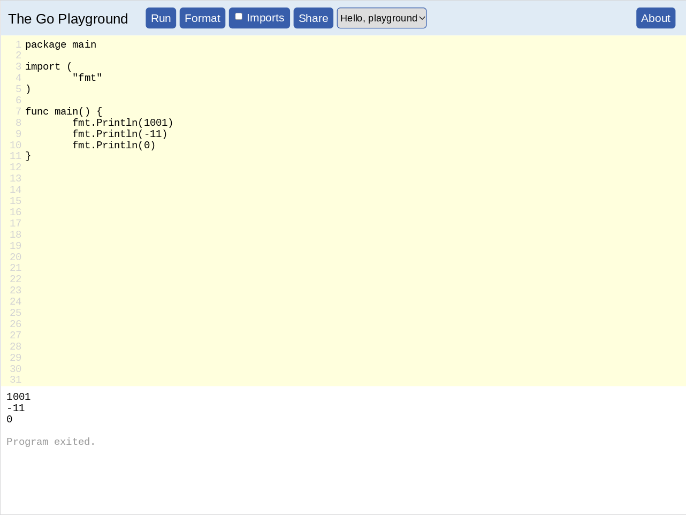
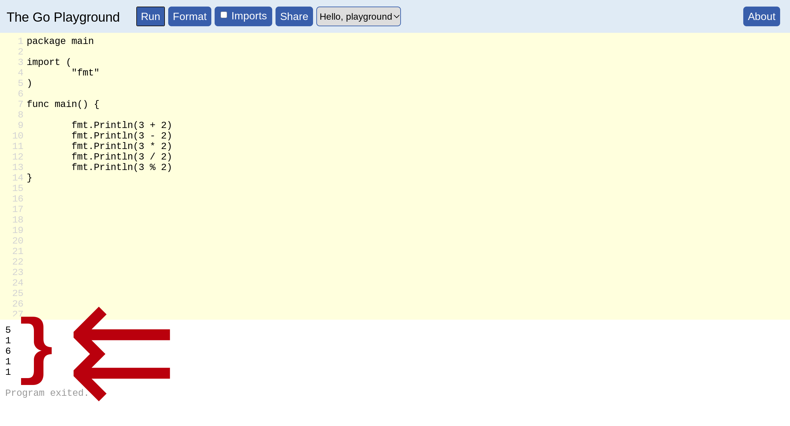

# Learn Golang In One Day

**Go** — also written as **Golang** — is a popular programming language.

This one day **workshop** aims to help you learn to be able to **code** in **Go**.

## Table of Contents

* [How To Learn](#how-to-learn)
* [PLAY.GOLANG.COM](#playgolangcom)
* [PLAY.GOLANG.COM — Hello world!](#playgolangcom--hello-world)
* [PLAY.GOLANG.COM — Hello YOUR NAME](#playgolangcom--hello-your-name)
* [PLAY.GOLANG.COM — fmt.Println()](#playgolangcom--fmtprintln)
* [PLAY.GOLANG.COM — fmt.Println() × 2](#playgolangcom--fmtprintln--2)
* [PLAY.GOLANG.COM — fmt.Println() × 3](#playgolangcom--fmtprintln--3)
* [Exercise — fmt.Println()](#exercise--fmtprintln)
* [PLAY.GOLANG.COM — fmt.Println() — multiple × 2](#playgolangcom--fmtprintln--multiple--2)
* [PLAY.GOLANG.COM — fmt.Println() — multiple × 3](#playgolangcom--fmtprintln--multiple--3)
* [PLAY.GOLANG.COM — fmt.Println() — multiple × 4](#playgolangcom--fmtprintln--multiple--4)
* [Exercise — fmt.Println() — multiple](#exercise--fmtprintln--multiple)
* [Very Basic Go Program Structure](#very-basic-go-program-structure)
* [PLAY.GOLANG.COM — Integers](#playgolangcom--integers)
* [PLAY.GOLANG.COM — Integer Math](#playgolangcom--integer-math)
* [PLAY.GOLANG.COM — Integer Math — version 2](#playgolangcom--integer-math--version-2)
* [Exercise — 1+2+3+5+8+13+21](#exercise--123581321)
* [PLAY.GOLANG.COM — drawing](#playgolangcom--drawing)
* [PLAY.GOLANG.COM — drawing — dye — 0](#playgolangcom--drawing--dye--0)
* [PLAY.GOLANG.COM — drawing — dye — 1](#playgolangcom--drawing--dye--1)
* [PLAY.GOLANG.COM — drawing — dye — 2](#playgolangcom--drawing--dye--2)
* [Exercise — c80.Dye()](#exercise--c80dye)
* [PLAY.GOLANG.COM — drawing — rectangle](#playgolangcom--drawing--rectangle)
* [PLAY.GOLANG.COM — drawing — more rectangles](#playgolangcom--drawing--more-rectangles)
* [Exercise — Draw a Face](#exercise--draw-a-face)
* [PLAY.GOLANG.COM — Variables](#playgolangcom--variables)
* [PLAY.GOLANG.COM — Variables — Move Face](#playgolangcom--variables--move-face)
* [Exercise — Move the Face](#exercise--move-the-face)


## How To Learn

EVEN THOUGH I HAVE SHOWN ALL THE CODE HERE.
DO NOT COPY-AND-PASTE THE CODE.
TYPE OUT THE CODE YOURSELF.
TYPING OUT THE CODE YOURSELF WILL HELP YOU LEARN TO CODE.

## PLAY.GOLANG.COM

One of the easiest ways to get started with **Go** is by going to https://play.golang.com/

When you get there you should see something like the following:


When you go to https://play.golang.com/ , it will have some **Go** **code** in there already for you.

```Go
package main

import (
	"fmt"
)

func main() {
	fmt.Println("Hello, playground")
}
```

You can **run** this code by clicking the blue colored button with “Run” written on it:


After you click the the blue colored button with “Run” written on it, that **Go** program will output some text.

That outputted text will be displayed at the bottom of the screen, in the white colored area:


If you are having trouble locating the outputted text, it is here:


Note that what is in between the double quotation marks in the code. I.e.,…
```Go
	fmt.Println("Hello, playground")
```

… is what you see in the output. I.e.,…
```
Hello, playground
```

## PLAY.GOLANG.COM — Hello world!

Now let's edit that **Go** **code**.

Let's change this code:
```Go
	fmt.Println("Hello, playground")
```

… to be:
```Go
	fmt.Println("Hello world!")
```


So the whole code would become:
```Go
package main

import (
	"fmt"
)

func main() {
	fmt.Println("Hello world!")
}
```

I.e.,…


Now run that.

And the output you should see should be:


And again note that what was between the double quotation marks:
```Go
	fmt.Println("Hello world!")
```
… is what you see in the output. I.e.,…
```
Hello world!
```

## PLAY.GOLANG.COM — Hello YOUR NAME

Let's get more personal. Let's make that code say your name.

So we are going to change this line:
```Go
	fmt.Println("Hello world!")
```

To something like:
```Go
	fmt.Println("Hello Charles!")
```

Of course, instead of “Charles” you should put whatever your name is.

So, if your name if “Robert”, then your code would be:
```Go
	fmt.Println("Hello Robert!")
```

And if your name is “Elizabeth”, then your code would be:
```Go
	fmt.Println("Hello Elizabeth!")
```

But I have to show some name in the screenshot, so I'll just use “Charles”:


Now run that.

And the output you should see should be something like:


Of course, the name you have outputted will be whatever name you used.

## PLAY.GOLANG.COM — fmt.Println()

So far we have just been focusing on what is in between the double quotation marks.
I.e., with the code:
```Go
	fmt.Println("Hello world!")
```
… we were only paying attention to the:
```
	             Hello world!
```

Now we want to pay attention to the `fmt.Println()` part of it.

What is that‽

It is a command. It is something we tell the computer to do.

What `fmt.Println()` means is: **print a line**.

(In fact, “Println” is short for “Print line”.)

## PLAY.GOLANG.COM — fmt.Println() × 2

Now let's write some code with more than one `fmt.Println()` command:
```Go
package main

import (
	"fmt"
)

func main() {
	fmt.Println("Hello world!")
	fmt.Println("I am your friendly neighborhood Golang.")
}
```

Now run that.

This is what you should see:


Note that you now have 2 lines of output.

This is because you have 2 `fmt.Println()` commands in your code.

## PLAY.GOLANG.COM — fmt.Println() × 3

What if we added another `fmt.Println()`:
```Go
package main

import (
	"fmt"
)

func main() {
	fmt.Println("Hello world!")
	fmt.Println("I am your friendly neighborhood Golang.")
	fmt.Println("See you later.")
}
```

Well, then we get another line of output:


Note that you now have 3 lines of output.

This is because you have 3 fmt.Println() commands in your code.

## Exercise — fmt.Println()

Now it is your turn write some **Go** **code** on your own.

Here is your exercise.

Write a **Go** program that outputs 7 lines.

(You decide what each text is on each of those lines)

## PLAY.GOLANG.COM — fmt.Println() — multiple × 2

By now you have some familiarity with `fmt.Println()`.

Now watch this:

```Go
package main

import (
	"fmt"
)

func main() {
	fmt.Println("Hello world!", "How are you doing?")
}
```

Did you notice that is different?

Look closely at the `fmt.Println()` command:
```Go
	fmt.Println("Hello world!", "How are you doing?")
```

Do you see it?

There are 2 strings in there, and not just 1.

Before we had stuff stuff as:
```Go
	fmt.Println("Hello world!")
	fmt.Println("I am your friendly neighborhood Golang.")
	fmt.Println("See you later.")
```

Which all only have 1 string inside of `fmt.Println()`.

But with:
```Go
	fmt.Println("Hello world!", "How are you doing?")
```
… we have 2 strings inside of `fmt.Println()`.

Let us see what happens when we run that code:

## PLAY.GOLANG.COM — fmt.Println() — multiple × 3

## PLAY.GOLANG.COM — fmt.Println() — multiple × 4

## Exercise — fmt.Println() — multiple

## Very Basic Go Program Structure

At this point, you may have noticed a pattern.

All these programs start with:
```Go
package main

import (
	"fmt"
)

func main() {
```

And they end with:
```Go
}
```

And between that beginning, and end is the code we write.

In other words:
```Go
package main

import (
	"fmt"
)

func main() {

	// YOUR
	//
	// CODE
	//
	// GOES
	//
	// HERE
}
```

So, for example, I could write:
```Go
package main

import (
	"fmt"
)

func main() {

	fmt.Println("I was here")
}
```

Or:
```Go
package main

import (
	"fmt"
)

func main() {

	fmt.Println("MY")
	fmt.Println("CODE")
	fmt.Println("IS")
	fmt.Println("HERE")
}
```

Or whatever else I want in that space!

## PLAY.GOLANG.COM — Integers

So far we have been dealing with **strings**.
**Strings** are the things between the double quotation marks.
For example:
```
	"Hello world!"
```

**Go** also supports **numbers**.

One type of **number** that go supports are **integers**.

For example:

* 5
* 4
* 3
* 2
* 1
* 0
* -1
* -2
* -3
* -4
* -5

Here are some more integers:

* -1234
* 742
* -1290387
* 927693
* -786320

Let's write a **Go** program that outputs some integers:
```Go
package main

import (
	"fmt"
)

func main() {
	fmt.Println(1001)
	fmt.Println(-11)
	fmt.Println(0)
}
```

When we run that we should get:



## PLAY.GOLANG.COM — Integer Math

One common thing people do with **numbers** — including **integers** — is **math**.

For example:

### Addition

```Go
3 + 2
```

### Subtration

```Go
3 - 2
```

### Multiplication

```Go
3 * 2
```
### Division

```Go
3 / 2
```

```Go
3 % 2
```

### Code

Let's see create some **Go** code to try all those out:
```Go
package main

import (
	"fmt"
)

func main() {

	fmt.Println(3 + 2)
	fmt.Println(3 - 2)
	fmt.Println(3 * 2)
	fmt.Println(3 / 2)
	fmt.Println(3 % 2)
}
```

When we run that we should get:



## PLAY.GOLANG.COM — Integer Math — version 2

The output of that was a bit difficult to read — in that it was a bit difficult to determine which number was the result of which calculation.

But we can fix that.

Take a look at this code:
```Go
package main

import (
	"fmt"
)

func main() {

	fmt.Println("3 + 2 =", 3 + 2)
	fmt.Println("3 - 2 =", 3 - 2)
	fmt.Println("3 * 2 =", 3 * 2)
	fmt.Println("3 / 2 =", 3 / 2)
	fmt.Println("3 % 2 =", 3 % 2)
}
```

That probably looks weird. Maybe even a bit confusing. So let's break that down.

Recall from before that we can put multiple things in a `fmt.Println()`. For example:
```Go
	fmt.Println("Hello world!", "How are you doing?")
```

That is what we did that in that new code too. We put multiple things in the `fmt.Println()`.

The 1st thing we put in the `fmt.Println()` are strings. The 2nd thing we in the `fmt.Println()` are those integer calculations.

This might make more sense if we just run the code. So let's run the code:


## Exercise — 1+2+3+5+8+13+21

It is now time for you to write a **Go** program of your own.

Write a program that outputs the result of this math operation:
```
1+2+3+5+8+13+21
```
## PLAY.GOLANG.COM — drawing

Let's change things up a bit.

So far the result of all of our **Go** programs has been plain text — letters, numbers, etc.

Let's use **Go** to create some images.

Recall from before that our basic **Go** program structure was:
```Go
package main

import (
	"fmt"
)

func main() {

	// YOUR
	//
	// CODE
	//
	// GOES
	//
	// HERE
}
```

So that we can draw images — rather that output plain text — we are going to make one change to that basic **Go** program structure was. This:
```Go
package main

import (
	"github.com/reiver/go-c80"
)

func main() {

	// YOUR
	//
	// CODE
	//
	// GOES
	//
	// HERE
}
```
Did you notce what changed‽ One thing changed.

This:
```Go
import (
	"fmt"
)
```

… changed into this:
```Go
import (
	"github.com/reiver/go-c80"
)
```

Changing this did 2 things:…

№1: the `fmt.Println()` function is gone, and

№2: we have a whole bunch of new functions available to use — that all start with `c80.` — that will give us the power to draw images.

## PLAY.GOLANG.COM — drawing — dye — 0

Enough talk, let's draw something.

Here is some **Go** code that will let us draw a rectangle:
```Go
package main

import (
	"github.com/reiver/go-c80"
)

func main() {

	c80.Draw(c80.Dye(0))

	c80.Reveal()
}
```
Now run that.

This is what you should see:

## PLAY.GOLANG.COM — drawing — dye — 1

Now let's change just one thing in that code.

Let's change this:
```Go
c80.Draw(c80.Dye(0))
```
… to this:
```go
c80.Draw(c80.Dye(1))
```

And thus have:
```Go
package main

import (
	"github.com/reiver/go-c80"
)

func main() {

	c80.Draw(c80.Dye(1))

	c80.Reveal()
}
```
Now run that.

This is what you should see:

## PLAY.GOLANG.COM — drawing — dye — 2

Now let's again change just one thing in that code.

This time let's change this:
```Go
c80.Draw(c80.Dye(1))
```
… to this:
```go
c80.Draw(c80.Dye(2))
```

And thus have:
```Go
package main

import (
	"github.com/reiver/go-c80"
)

func main() {

	c80.Draw(c80.Dye(2))

	c80.Reveal()
}
```
Now run that.

This is what you should see:

## Exercise — c80.Dye()

Now it is your turn write some **Go code** on your own.

Here is your exercise.

Figure out what integer will give you a **yellow** color.

Figure out what integer will give you a **blue** color.

Figure out what integer will give you a **grey** color.

## PLAY.GOLANG.COM — drawing — rectangle

## PLAY.GOLANG.COM — drawing — more rectangles

## Exercise — Draw a Face

## PLAY.GOLANG.COM — Variables

## PLAY.GOLANG.COM — Variables — Move Face

## Exercise — Move the Face


## PLAY.GOLANG.COM — drawing — pixel

## PLAY.GOLANG.COM — drawing — color

## Exercise — Color the Face


## CLI

## CLI — go run

## CLI — go build

## CLI — fmt.Scan()

## CLI — Adding Calculator

We now have the skills necessary to create our own very basic **calculator**.

In fact, our calculator will be very very very basic.

All it will do it add 2 numbers that we give it.

Here is the code.

REMEMBER, TYPE THIS CODE OUT YOURSELF. DO NOT COPY-AND-PASTE IT. TYPING IT OUT WILL HELP YOU LEARN IT.

```Go
package main

import (
	"fmt"
)

func main() {
	fmt.Println("Please provide the first number:")

	var firstNumber int
	fmt.Scan(&firstNumber)

	fmt.Println("Please provide the second number:")

	var secondNumber int
	fmt.Scan(&secondNumber)

	fmt.Println("Result:")
	fmt.Println(firstNumber + secondNumber)
}
```

Run this program and see if it works.

## Exercise — Subtracting Calculator

## CLI — switch

## CLI — Multifunctional Calculator

Now that we learned the **Go** `switch` statement, we can create something pretty cool.

Now that we know how to use the **Go** `switch` statement, we can use it to make a calculator handle both **addition**, and **subtraction**.

Most normal calculators don't just handle addition, or just handle subtraction.
Most normal calculators handle both addition **and** substraction.

So we are going to do that.
We are going to make a calculator that can handle both addition **and** substraction.

Here is our **Go** **code** for that:

```Go
package main

import (
	"fmt"
)

func main() {
	fmt.Println("Please provide the first number:")

	var firstNumber int
	fmt.Scan(&firstNumber)

	fmt.Println("Please provide the second number:")

	var secondNumber int
	fmt.Scan(&secondNumber)

	fmt.Println("Please tell me what operation you want to do:")

	var operation string
	fmt.Scan(&operation)

	var result int
	switch operation {
	case "+":
		result = firstNumber + secondNumber
	case "-":
		result = firstNumber - secondNumber
	}

	fmt.Println("Result:")
	fmt.Println(result)
}
```

## Exercise — Add Multiplication To The Multifunctional Calculator

## CLI — for-ever

## CLI — Looping Calculator

## CLI — Exiting Looping Calculator

## CLI — os.Args

## CLI — os.Open()

## CLI — io.Read

## CLI — Interpreter

## Exercise — Add Division To The Interpreter

## CLI — io.Write

## drawing — size

## drawing — Animation

## drawing — MouseX & MouseY

## drawing — MousePressed

## drawing — if

## drawing — if-else

## drawing — func

## Exercise — Many Faces
